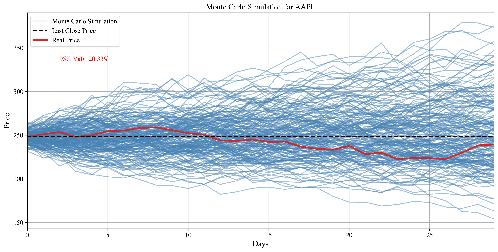

# A Python-based quantitative finance toolkit for portfolio optimization and analysis.

## Features
- Find and optimise Buy/Sell signals based on momentum (moving average): [buy_sell_signals](buy_sell_signals.ipynb)

- Find Call/Put prices of options using Alpaca-API and Black-Scholes-Merton model: [options_pricing](option_pricing.ipynb)

- Efficient frontier calculation and visualization, Risk-return optimization, portfolio rebalancing tools : [portfolio_rebalance](portfolio_rebalance.ipynb)

- Find safer stocks for bear market: [find_safer_stocks_for_bear_market](find_safer_stocks_for_bear_market.ipynb)]

- Find best stocks for value investing: [find_value_stocks](find_value_stocks.ipynb)
- Use Bollinger Bands/Keltner Channels for optimum trading strategy: [bollinger_bands](bollinger_bands.ipynb)

- Generate Monte Carlo simulation and calculate Value at Risk (VaR): [monte_carlo_simulation](monte_carlo_simulation.ipynb)

## Getting Started
Check the documentation to begin optimizing your investment portfolio using advanced quantitative methods.
