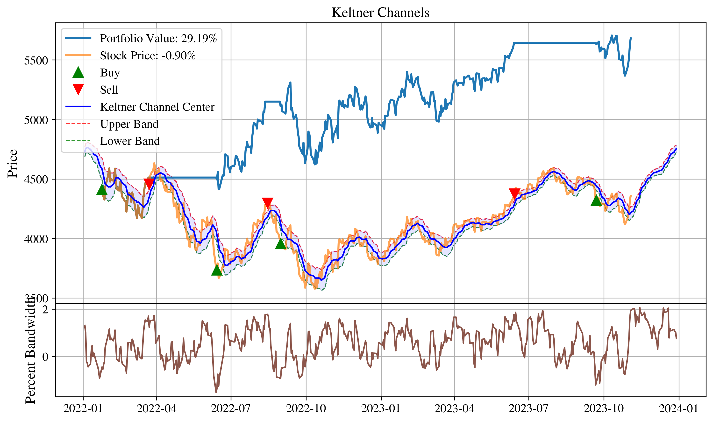

# Quant Finance Portfolio Optimization

## Maximum Return Portfolio (with σ ≤ S&P500)

| Stock | Weight % | Market Cap Weight % | Difference % |
|-------|----------|-------------------|--------------|
| NVDA  | 24.81    | 16.79             | 8.03         |
| TSLA  | 17.39    | 6.31              | 11.08        |
| MSFT  | 13.81    | 15.68             | -1.87        |
| META  | 10.59    | 7.85              | 2.74         |
| GOOG  | 10.45    | 11.93             | -1.48        |
| GOOGL | 8.06     | 11.94             | -3.88        |
| AAPL  | 8.01     | 17.94             | -9.93        |
| AMZN  | 6.88     | 11.57             | -4.69        |

**Portfolio Metrics:**
- Expected Monthly Return: 3.41%
- Standard Deviation: 4.80%
- Sharpe Ratio: 0.293

# A Python-based quantitative finance toolkit for portfolio optimization and analysis.

## Features
- Efficient frontier calculation and visualization : [portfolio_rebalance](portfolio_rebalance.ipynb)
- Risk-return optimization: [portfolio_rebalance](portfolio_rebalance.ipynb)
- Portfolio rebalancing tools: [portfolio_rebalance](portfolio_rebalance.ipynb)
- Find safer stocks for bear market: [find_safer_stocks_for_bear_market](find_safer_stocks_for_bear_market.ipynb)]
- Buy/Sell signals based on momentum (moving average): [buy_sell_signals](buy_sell_signals.ipynb)
- Find best stocks for value investing: [find_value_stocks](find_value_stocks.ipynb)
- Use Bollinger Bands for optimum trading strategy: [bollinger_bands](bollinger_bands.ipynb)

## Getting Started
Check the documentation to begin optimizing your investment portfolio using advanced quantitative methods.
