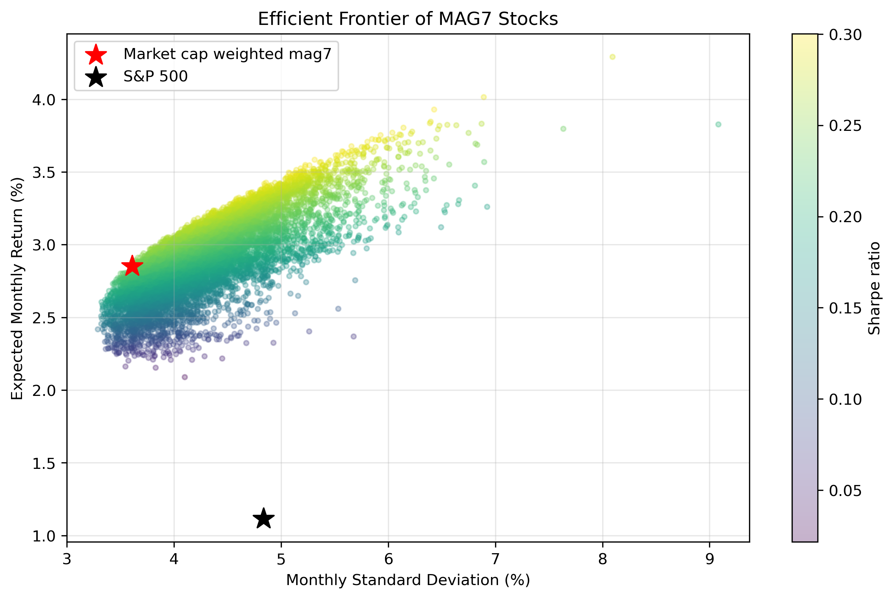

# Quant Finance Portfolio Optimization

>Maximum Return Portfolio (with σ ≤ S&P500):
>Stock  Weight %  Market Cap Weight %  Difference %
>1   NVDA     24.81                16.79          8.03
>7   TSLA     17.39                 6.31         11.08
>2   MSFT     13.81                15.68         -1.87
>6   META     10.59                 7.85          2.74
>3   GOOG     10.45                11.93         -1.48
>4  GOOGL      8.06                11.94         -3.88
>0   AAPL      8.01                17.94         -9.93
>5   AMZN      6.88                11.57         -4.69
>
>Expected Monthly Return: 3.41%
>Standard Deviation: 4.80%
>Sharpe Ratio: 0.293

A Python-based quantitative finance toolkit for portfolio optimization and analysis.

## Features
- Efficient frontier calculation and visualization
- Risk-return optimization
- Portfolio rebalancing tools

## Getting Started
Check the documentation to begin optimizing your investment portfolio using advanced quantitative methods.
